<h1 align="center">
Hi there👋, I’m Wenbo Lv 🌌
</h1>
<!-- <h4 align="center">Loves Programming and Open Source!</h3> -->

<table>
<tr>
<td>

</td>
<td>

</td>
</tr>
</table>

I use these R packages a lot:

<a href="https://github.com/r-tmap/tmap"           >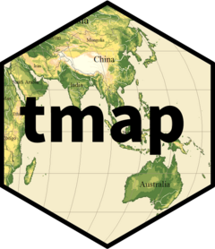</a>

<a href="https://github.com/Rdatatable/data.table/">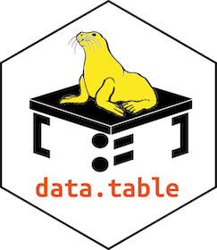</a>

<!--   <a href="https://github.com/r-lib/vctrs"           >
<!-- src="./logos/vctrs.png"                 width="50px"/></a> -->

I authored and maintain these R packages:

<a href="https://github.com/ausgis/GD"             >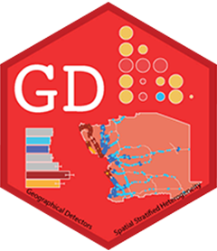</a>
<a href="https://github.com/ausgis/geocomplexity"  >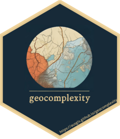</a>
<a href="https://github.com/stscl/cisp"            >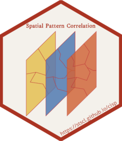</a>

<a href="https://github.com/stscl/gdverse"         >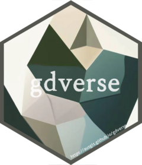</a>

<a href="https://github.com/stscl/spEDM"           >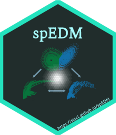</a>
<a href="https://github.com/stscl/tEDM"            >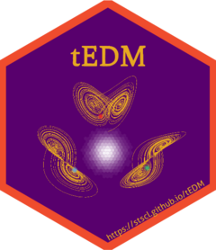</a>
<a href="https://github.com/stscl/infocausality"   >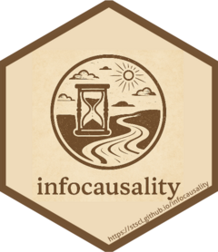</a>
<a href="https://github.com/stscl/geocn"           >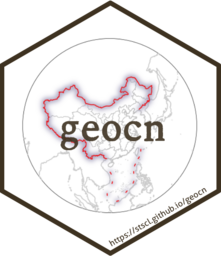</a>

<a href="https://github.com/stscl/arcR"            >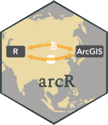</a>

### 🧐 About

<!-- - 🔭 I am currently a research assistant at *The Hong Kong University of Science and Technology (Guangzhou)* and *The Hong Kong Polytechnic University*. -->

- 🏄 My research interests lie in **advancing methodologies in spatial
  causal inference** and **developing high-performance computational
  tools**, with a primary focus on *R packages*.
- 🔬 Currently, my work centers on **Empirical Dynamic Modeling (EDM)**
  framework for modeling *dynamic system*, **information theory** for
  quantifying *information flow* and *causal interdependence*,
  **ordinary differential equations (ODEs)** for characterizing
  *spatiotemporal processes* and *system evolution*, as well as
  **counterfactual** and **potential outcomes** framework for estimating
  *causal effects*. I aim to integrate these approaches to better
  understand and address complex challenges in *urban sustainability*,
  *climate change mitigation*, and broader global issues.
- 😄 I look forward to working with friends of all backgrounds to
  explore the fun of **statistics** and **programming**!
- 📫 How to reach me: message me at
  [*zhihu*](https://www.zhihu.com/people/lyu-geosocial) and
  [*mastodon*](https://mastodon.social/@SpatLyu)!
- 💬 Ping me about \#GeoInformatics, \#Statistics, \#Causality, \#R,
  \#C++, \#Python and anything you like!
