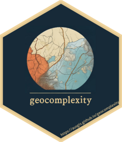
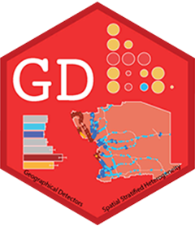
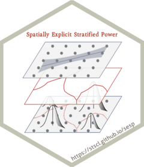
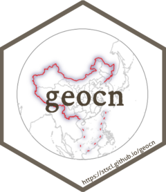

---
output:
  md_document:
    variant: gfm
html_preview: false
---

# Hi there 👋

## I'm Wenbo Lv, a relatively dedicated boy who loves programming and open source!

`r badger::badge_custom("buy me a", "Coffee", "purple", "https://spatlyu.github.io/posts/posts-picture/alipay.jpg")`

`r badger::badge_custom("follow me on", "WeChat", "green", "https://spatlyu.github.io/posts/posts-picture/lyu_spatstat-wechat.jpg")`

I use these R packages a lot: 

 
    
  
  
    
    
  
  
  
  
  
  
  
    
<!--   <a href="https://github.com/r-tmap/tmap"           >
<!-- src="./logos/tmap.png"                  width="50px"/></a> -->

I authored and maintain these R packages:

 
    
    
    
    
    
    
    
    
  
  
  
  
  

  
## 🧐 About

- 🔭 I am currently an undergraduate majoring in *Geographic Information Science*(**GIS**) at Shaanxi Normal University(SNNU).
- 😄 I look forward to working with friends of all backgrounds to explore the fun of **statistics** and **programming**!
- 🏄‍ My research interests focus on **developing innovative spatial analysis methods** that leverage **spatial relationships**, such as *spatial dependence*, *spatial heterogeneity*, and *geographical similarity*, to advance *urban sustainability* and *climate change mitigation* efforts, and also include **developing the corresponding open source software**.
- 🌱 My motto in life is to grow as you learn!
- 👯 And Many More...

#  Hello world!&nbsp;

- 💬 Ask me about anything and everything!
- 📫 How to reach me: message me at [*zhihu*](https://www.zhihu.com/people/lyu-geosocial) and [*mastodon*](https://mastodon.social/@SpatLyu)!
- ⚡ Fun fact: I love coding, reading, thinking and eating delicious food.
- 💬 Ping me about #GeoInformatics, #Statistics, #R, #C++, #Python and anything you like!

